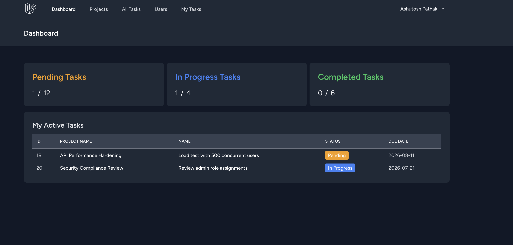
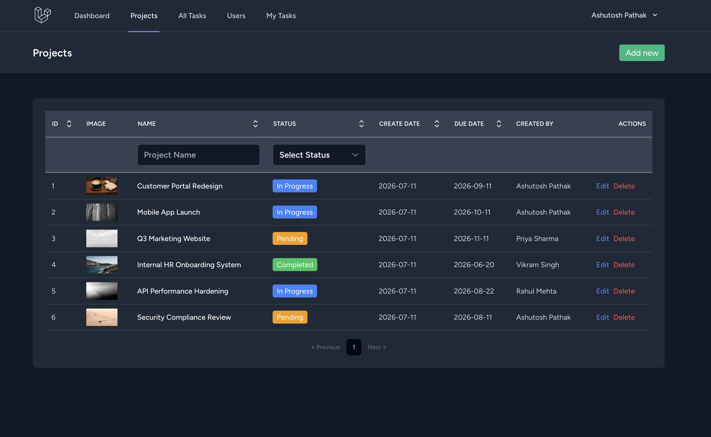
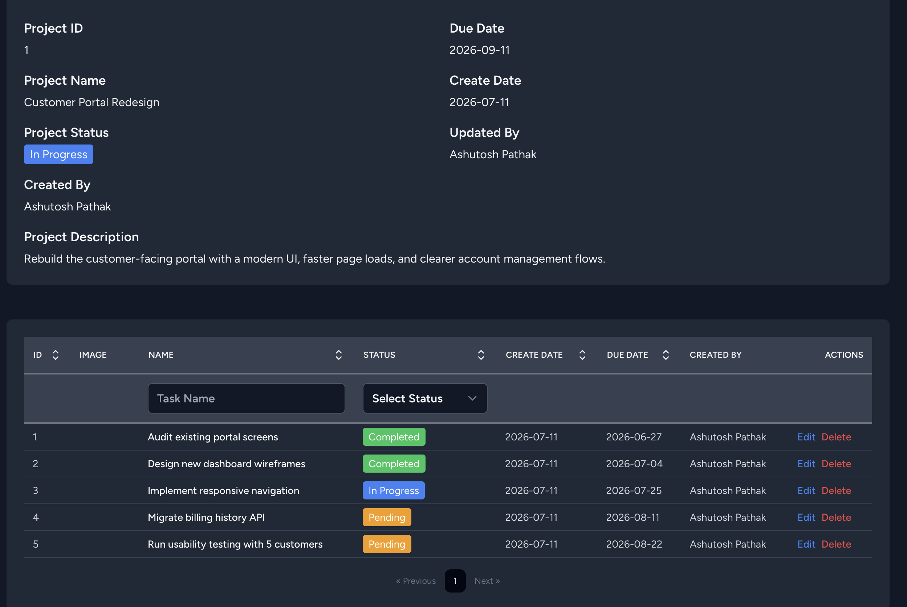
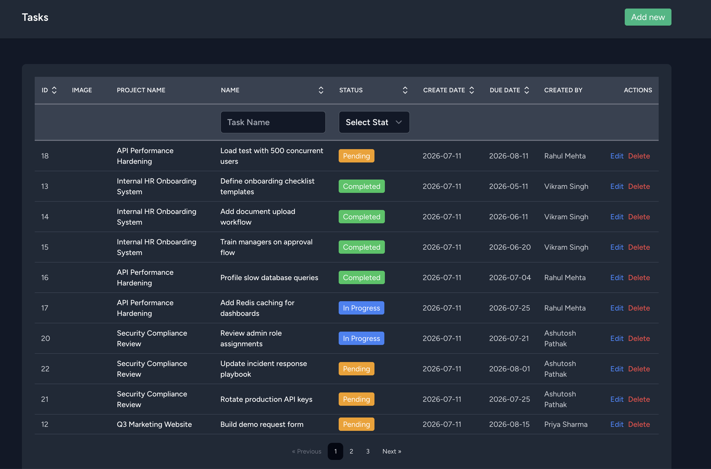
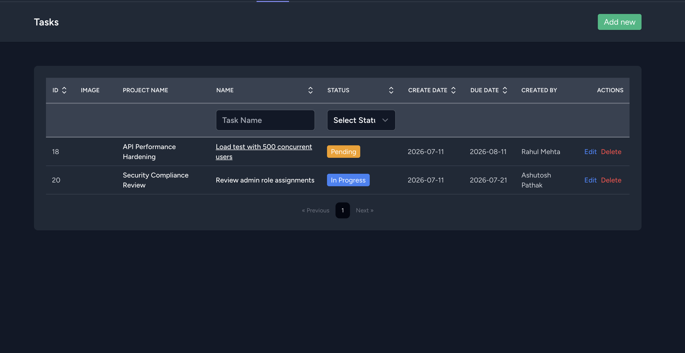
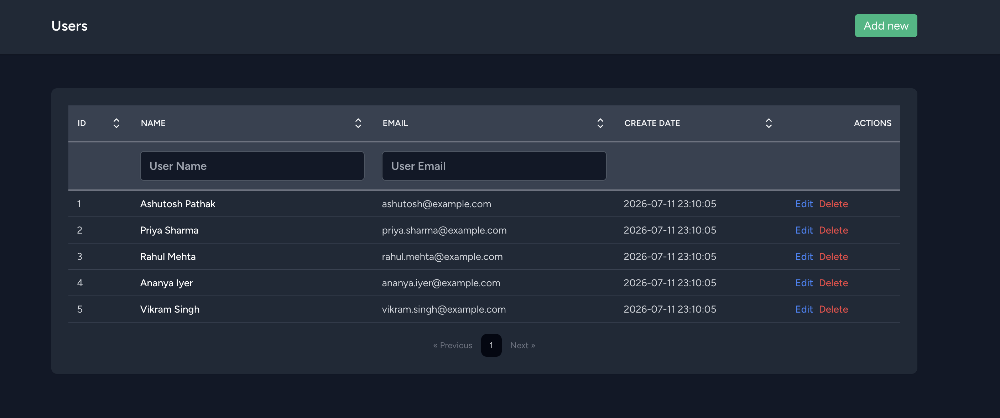

# Project Management App

Laravel 11 + Inertia.js (React) app for managing projects, tasks, and users.

## Screenshots

### Dashboard


### Projects


### Project details


### All Tasks


### My Tasks


### Users


## Prerequisites

- [Docker Desktop](https://docs.docker.com/get-docker/) (includes Docker Compose)
- Git

No local PHP, Composer, Node, or MySQL install is required.

## Quick start (clone → run)

```bash
git clone <repository-url> project-management-app
cd project-management-app

docker compose up --build
```

On first start the app container automatically:

1. Copies `.env.example` → `.env` (if `.env` is missing)
2. Installs PHP dependencies (`composer install`)
3. Generates `APP_KEY`
4. Waits for MySQL to be healthy
5. Runs **migrations** (`php artisan migrate`)
6. Runs **seeders** (`php artisan db:seed`) when the database is empty
7. Creates the public storage link
8. Starts the Laravel server

The Vite container installs npm packages and starts the frontend dev server.

First boot can take a few minutes while images build and dependencies install.

### Open the app

| Service | URL |
|---------|-----|
| Application | http://localhost:8000 |
| Vite (HMR) | http://localhost:5173 |
| MySQL | `localhost:3306` |

### Log in

| Email | Password | Role |
|-------|----------|------|
| `ashutosh@example.com` | `Ashu@123` | Admin |
| `priya.sharma@example.com` | `password` | Team member |
| `rahul.mehta@example.com` | `password` | Team member |
| `ananya.iyer@example.com` | `password` | Team member |
| `vikram.singh@example.com` | `password` | Team member |

Seeded sample projects include Customer Portal Redesign, Mobile App Launch, Q3 Marketing Website, and more, with assigned tasks.

## What gets set up for you

| Step | How it runs |
|------|-------------|
| Environment file | Auto-created from `.env.example` |
| Composer packages | Auto on container start |
| NPM packages | Auto in the `vite` service |
| App key | Auto (`php artisan key:generate`) |
| Database | MySQL 8 container (`project_management`) |
| Migrations | Auto (`php artisan migrate --force`) |
| Seeders | Auto when users table is empty |
| Storage link | Auto (`php artisan storage:link`) |

You do **not** need to run `migrate` or `db:seed` manually after a fresh clone.

## Common commands

```bash
# Start in the background
docker compose up --build -d

# Follow logs
docker compose logs -f

# Stop containers (keeps database volume)
docker compose down

# Stop and wipe the database volume (next start migrates + seeds again)
docker compose down -v
docker compose up --build
```

### Manual Artisan commands (optional)

```bash
# Run migrations only
docker compose exec app php artisan migrate

# Re-run seeders on an empty DB, or after wiping data
docker compose exec app php artisan db:seed

# Reset schema and seed fresh demo data
docker compose exec app php artisan migrate:fresh --seed

# Tinker / shell
docker compose exec app php artisan tinker
docker compose exec app bash
```

## Services

| Service | Role |
|---------|------|
| `app` | PHP 8.2 + Laravel (`php artisan serve` on port 8000) |
| `mysql` | MySQL 8.0 database |
| `vite` | Node 20 + Vite React HMR on port 5173 |

## Environment defaults

Created automatically from `.env.example`:

| Variable | Default |
|----------|---------|
| `APP_URL` | `http://localhost:8000` |
| `DB_CONNECTION` | `mysql` |
| `DB_HOST` | `mysql` |
| `DB_PORT` | `3306` |
| `DB_DATABASE` | `project_management` |
| `DB_USERNAME` | `sail` |
| `DB_PASSWORD` | `password` |

Optional overrides in project `.env` (also read by Compose):

```env
APP_PORT=8000
VITE_PORT=5173
FORWARD_DB_PORT=3306
APP_URL=http://localhost:8000
VITE_DEV_SERVER_URL=http://localhost:5173
```

## Troubleshooting

**Port already in use** — set alternate ports in `.env`, then restart:

```env
APP_PORT=8080
VITE_PORT=5174
FORWARD_DB_PORT=3307
APP_URL=http://localhost:8080
VITE_DEV_SERVER_URL=http://localhost:5174
```

```bash
docker compose down
docker compose up --build
```

**Blank page / assets missing** — wait for Vite to finish `npm install`, then check:

```bash
docker compose logs vite
```

**Need a clean database again**

```bash
docker compose down -v
docker compose up --build
```

Migrations and seeders run again because the MySQL volume is new and empty.

**Permission errors on `storage/` or `bootstrap/cache`**

```bash
chmod -R ug+rwx storage bootstrap/cache
```

**Containers fail to start** — rebuild from scratch:

```bash
docker compose down -v --rmi local
docker compose up --build
```
